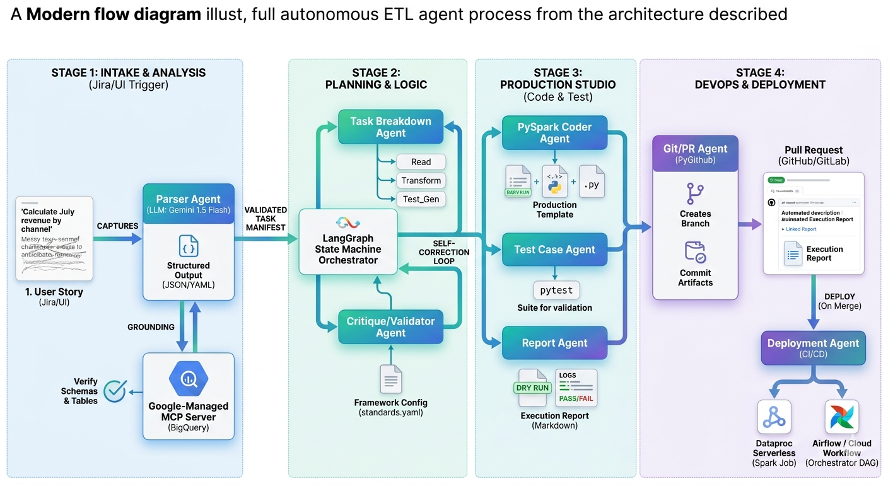

# 🤖 Agentic-ETL-Orchestrator
> **Autonomous Data Engineering Agent powered by LangGraph & MCP**

[](https://cloud.google.com/)
[](https://www.python.org/)
[](https://github.com/langchain-ai/langgraph)

---

## 🏗️ System Architecture
This project implements a **Self-Healing Multi-Agent System** that transforms unstructured business requirements (Jira/UI) into production-ready, audited ETL pipelines.



### 🧩 The 4-Stage Autonomous Flow
1. **Intake & Analysis:** Extracts intent from Jira and uses **Model Context Protocol (MCP)** to verify schemas in BigQuery.
2. **Planning & Logic:** Orchestrates task breakdown via **LangGraph** with a Senior DE "Critique" loop.
3. **Production Studio:** Generates modular **PySpark** code and performs **Static Code Analysis (SCA)** to prune dead code.
4. **DevOps & Deployment:** Raises a GitHub PR with automated execution reports and performance scores.

---

## 🛠️ Tech Stack
| Component | Technology |
| :--- | :--- |
| **LLM** | Gemini 1.5 Flash (Vertex AI) |
| **Orchestration** | LangGraph & Pydantic |
| **Data Grounding** | Model Context Protocol (MCP) |
| **Processing** | Apache Spark (PySpark) & BigQuery |
| **Infrastructure** | GCP (Dataproc Serverless, Secret Manager) |

---

## 🚀 Key Features
* **Zero-Hallucination:** MCP ensures the agent only writes code for columns that actually exist.
* **Shift-Left Quality:** Automated linting removes unused variables and flags BigQuery anti-patterns.
* **Self-Correction:** Agents automatically refactor logic if unit tests or audit checks fail.

---

## 📂 Project Structure
```bash
├── agents/            # Specialized Agent Nodes (Parser, Auditor, Coder)
├── config/            # standards.yaml & Framework Constraints
├── inputs/            # User Stories & Jira Mocks
├── notebooks/         # Prototyping & Connectivity Tests
└── README.md
